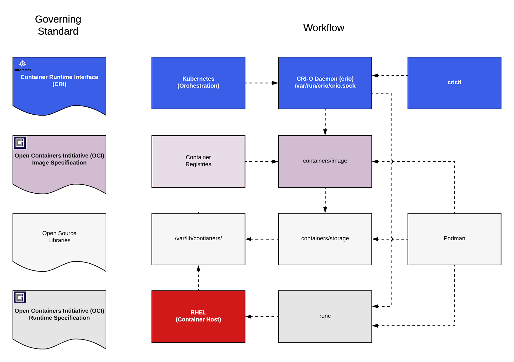

# [Podman](https://github.com/containers/podman)

Podman 兼容所有的 `docker` 命令，并且提供了更丰富的功能，完全兼容 OCI 和 Docker 两种格式的镜像。

总而言之，Podman 是面向用户的下一代容器工具，而 CRI-O 则是 kubernetes 的下一代容器运行时，Podman 和 CRI-O 未来将共用同一套底层代码。

目前 cri-o 和 podman 还未共用同一套底层代码 libpod，这导致 cri-o 和 podman 的容器是不互通的。
表现出的现象就是，使用 crictl 查询不到 podman 创建的容器，反之亦然。

cri-o 和 podman 的层次架构图：



## Podman 和 Buildah 的关系

podman 和 buildah 都是命令行工具，而且 buildah 被集成进了 podman 中。

podman 和 docker 一样，目标在于提供一套完整的容器解决方案。

而 buildah 则和 kaniko/buildkit 类似，专注于镜像的构建，这从它的名字就能体现出来。
buildah/kaniko/buildkit 三个工具都支持 rootless/daemonless 地构建容器镜像。
但是目前 buildah 貌似没有完善的镜像缓存功能，因此 CI/CD 还是更推荐 kaniko/buildkit.

## Podman 可以直接使用 kubernetes 配置

使用 podman 直接部署 k8s deployment:

```shell
podman play kube xxx.yaml
```

上述命令可以直接使用 kubernetes 的 deployemnt/job 创建容器。
不过 podman 没有控制器，因此只会创建 pod，而 deployment/job 的特殊参数会被忽略。

不得不说，真香!

## 设置镜像源

podman 的专用镜像仓库配置位置为用户级别的 `$HOME/.config/containers/registries.conf` 和系统级别的 `/etc/containers/registries.conf`.

配置示例如下：

```toml
# For more information on this configuration file, see containers-registries.conf(5).
#
# Registries to search for images that are not fully-qualified.
# i.e. foobar.com/my_image:latest vs my_image:latest
[registries.search]
registries = ["docker.io"]

# Registries that do not use TLS when pulling images or uses self-signed
# certificates.
[registries.insecure]
registries = ["registry.svc.local"]
```

## 设置代理

Podman 是无后台服务的，因此直接在 shell 环境下通过环境变量，就可以设置代理：

```shell
export HTTPS_PROXY=http://localhost:8889
export NO_PROXY=*.aliyuncs.com,localhost
```

现在直接拉镜像，就会走代理了：

```shell
podman pull golang:1.15-buster
```


## 参考文档

- [Crictl Vs Podman - RedHat](https://www.openshift.com/blog/crictl-vs-podman)
